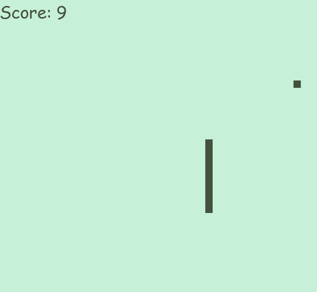
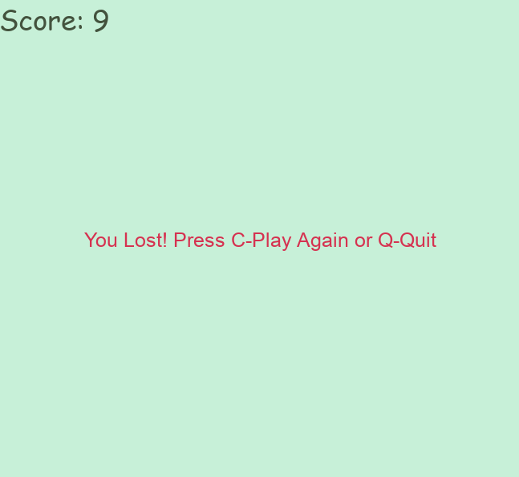

# Classic Snake Game 🐍

## 📖 Description

A retro-style Snake game built with Python and Pygame. This project recreates the classic experience with a Nokia-inspired color palette.
Control the snake, eat the food to grow longer, and avoid hitting the walls or your own tail! As you eat, and your score increases.

> [!NOTE]
> *I made this game as part of my Python coding learning journey.*
---

## ✅ Features

- **Classic Gameplay:** Navigate a grid to eat food.
- **Dynamic Food:** Every third piece of food grows to double the size!
- **Retro Aesthetics:** "Nokia Green" background and dark elements.
- **Score Tracking:** Real-time score display.
- **Game Over Screen:** Options to restart (`C`) or quit (`Q`).
- **Input Handling:** Logic to prevent the snake from reversing into itself immediately.

---

## 💻 Prerequisites

This project uses [uv](https://github.com/astral-sh/uv), an extremely fast Python package and project manager.

If you don't have `uv` installed yet, you can install it on Ubuntu/macOS using:

```bash
curl -LsSf [https://astral.sh/uv/install.sh](https://astral.sh/uv/install.sh) | sh

```

*(For Windows or other installation methods, see the [official uv documentation](https://www.google.com/search?q=https://docs.astral.sh/uv/getting-started/installation/).)*

---

## 👇 Installation

With `uv`, setting up the project is practically instant.

- **Open your terminal** in the folder containing the project files.
- **Sync the project:**
Run the following command to automatically create an isolated virtual environment and install all necessary dependencies (like Pygame):

```bash
uv sync

```

---

## ▶️ How to Play

- Navigate to the folder containing the game in your terminal.
- Run the game using `uv` (this automatically uses the correct environment):

```bash
uv run snake_game.py

```

- **Controls:**
- **Arrow Keys:** Move Up, Down, Left, Right.
- **Q:** Quit the game (when on the Game Over screen).
- **C:** Play Again (when on the Game Over screen).

## 📸 Screenshots of the Game





---

## 💡 Code Highlights (For Learners)

If you are looking at the code, here are the key concepts used:

- **Grid System:** The game uses a block size (`SNAKE_BLOCK = 15`). All positions (snake segments and food) are calculated to snap to this grid using math logic.
- **Dynamic Sizing:** Uses the modulo operator to double the food size for every third item.
- **Game Loop:** The `while not game_over:` loop is the heart of the game, updating the screen and checking logic every frame.
- **List Management:** The snake is represented as a list of coordinates (`snake_List`), growing as food is eaten and removing the tail as it moves.

---

## ⚠️ Disclaimer

> [!CAUTION]
> This project is provided "as-is" without any warranty of any kind. I am not responsible for any issues, data loss, or problems caused (code-related or otherwise). **Use it at your own risk.**
